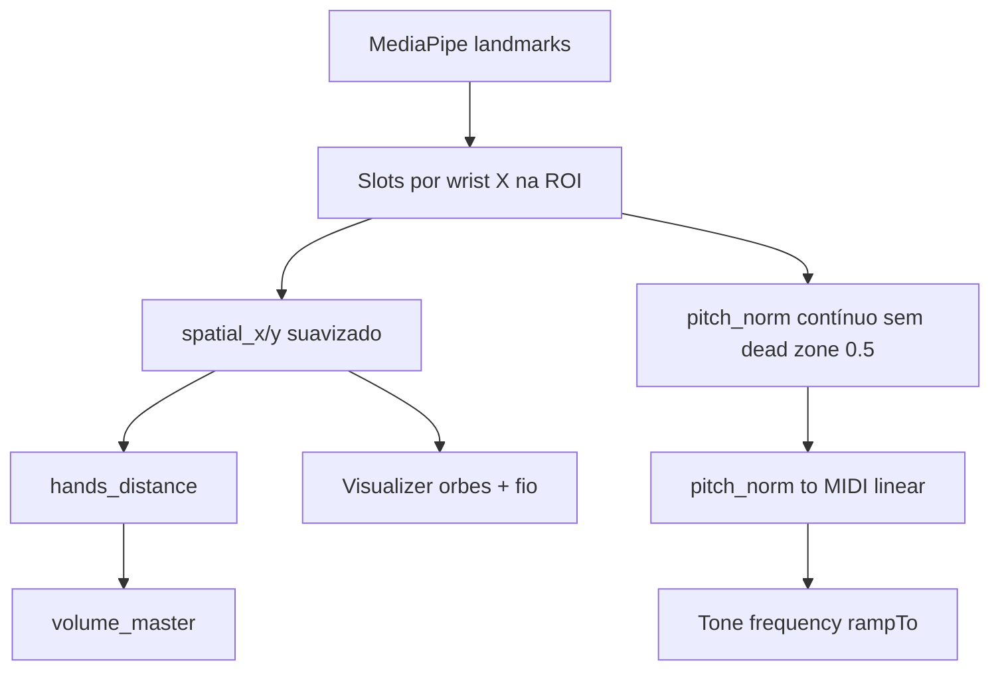

# Experiência fluida — sem agarrões vertical/horizontal

## O que as capturas mostram

- Bolas **empilhadas no centro** (laranja em cima, ciano em baixo): `y` no desenho vem de **pitch quantizado**, não da posição real do punho.
- **Uma bola no centro-direita** com mão visível noutro sítio: slots fixos por `handedness` MediaPipe + eixo X não espacial.
- HUD **0–1 fps**: loop sobrecarregado ou bloqueado (MediaPipe + `setState` a cada frame + mapper a 60 Hz).

## Causas confirmadas no código

| Sensação “agarrado”           | Origem                                                                                                                                                                               |
| ----------------------------- | ------------------------------------------------------------------------------------------------------------------------------------------------------------------------------------ | --- | ----- |
| **Vertical** (meio da escala) | [`ZoneQuantizer`](packages/mapping/src/scale.ts) — faixas discretas + platôs; [`applyDeadZone(..., 0.5)`](packages/mapping/src/smooth.ts) **congela** valores perto do centro em 0.5 |
| **Horizontal** (meio da tela) | [`assignHandSlots`](packages/vision/src/snapshot.ts) prende mão “Left”/“Right” ao rótulo MediaPipe, não à posição X na ROI; orbes usam `x`/`y` de controlo musical, não punho        |
| **Bolas sempre separadas**    | Mesmo problema de coords + `hands_distance` com `max(                                                                                                                                | dx  | , …)` |
| **Lag / 0 fps**               | [`useInstrumentLoop`](apps/instrument/src/useInstrumentLoop.ts) + [`useAudioEngine`](apps/instrument/src/useAudioEngine.ts)                                                          |

**Mudança de direção:** o plano anterior (refinar `ZoneQuantizer` ±1, `holdFrames`, debounce de grau) **não atende** o pedido atual. O utilizador quer **transição livre por semitons**, sem degraus de zona.

---

## Arquitetura alvo



Gestos **inalterados**: palma = gate, punho = solta, V = volume, polegar = oitava. Só muda **como** o pitch e o espaço são mapeados e desenhados.

---

## 1. Grelha em tela cheia

[`apps/instrument/src/Visualizer.tsx`](apps/instrument/src/Visualizer.tsx)

- Grelha decorativa em `(0,0)–(w,h)`.
- ROI: máscara + borda verde; **remover linhas horizontais de “zonas da escala”** (reforçavam quantização visual).
- Opcional: referência contínua suave (1 linha central ou gradiente), não N faixas discretas.

---

## 2. Slots espaciais — mão esquerda pode ir para a direita

[`packages/vision/src/snapshot.ts`](packages/vision/src/snapshot.ts)

Substituir `assignHandSlots` baseado em `handedness` por:

1. Para cada mão detectada, calcular `wristX` (landmark 0) na câmera.
2. Ordenar por `wristX` ascendente → slot `left` = menor X, slot `right` = maior X (posição na imagem espelhada, não rótulo MediaPipe).
3. Manter `handedness` original no `HandState` só para gestos/triggers (`hand: left` no YAML).
4. Com uma mão: slot único pelo `wristX` vs centro da ROI (ou histórico curto), sem forçar sempre o lado esquerdo.

**Papel musical** ([`mapper.ts`](packages/mapping/src/mapper.ts)): gate/pitch continuam no slot configurado como `gesture_roles.right` (mão “de controle”), identificado pelo **índice de slot** `right`, não pelo rótulo MediaPipe.

---

## 3. Pitch contínuo em semitons (eliminar agarrão vertical)

### 3.1 Remover fontes de “sticky center”

- **Desativar** `applyDeadZone` para eixos de pitch (`ly`, `ry`) — remover snap a 0.5.
- **Deixar de chamar** `ZoneQuantizer.quantize` no path `scale_gate` de produção.
- Manter `ZoneQuantizer` apenas se necessário para HUD legado ou testes; preferir deprecar no mapper.

### 3.2 Novo mapeamento contínuo

**Novo helper** em [`packages/mapping/src/scale.ts`](packages/mapping/src/scale.ts) (ou `pitch.ts`):

```ts
// pitch_norm 0..1 → MIDI contínuo entre primeira e última nota da escala (+ oitavas)
pitchNormToMidi(norm, scaleName, octaveShift): number
midiToNoteName(midi): string  // para HUD
```

- Intervalo: `midiMin` = primeira nota da escala + `octaveShift`; `midiMax` = última nota + `octaveShift`.
- `midi = midiMin + clamp01(norm) * (midiMax - midiMin)` — **todos os semitons** entre extremos, independentemente de pentatonic/major no nome da escala.
- `pitch_norm` no frame = valor **suavizado** (EMA `pitch_alpha` ~0.15–0.2), sem dead zone.

**Protocolo** [`packages/protocol/src/index.ts`](packages/protocol/src/index.ts):

- `spatial_x`, `spatial_y` — punho na ROI (desenho).
- Opcional: `pitch_midi` (número contínuo) para o áudio não recalcular.
- `scale_degree` — só **display** (nota mais próxima), não comando de som.

### 3.3 Mapper

[`packages/mapping/src/mapper.ts`](packages/mapping/src/mapper.ts):

- Mão de pitch: preencher `pitch_norm`, `pitch_midi`, `spatial_*`; `scale_degree` = arredondamento para HUD.
- Gate fechado: congelar último `pitch_midi` / não atualizar som.

**YAML** [`config/default-instrument.yaml`](config/default-instrument.yaml):

```yaml
scale:
  mode: continuous # substitui lógica de zone_ratio para playback
  # zone_ratio / hysteresis ignorados no modo continuous
smoothing:
  alpha: 0.2
  pitch_alpha: 0.15
  dead_zone: 0 # ou omitir para pitch
```

Espelho Python para paridade CLI.

---

## 4. Visual e volume fiéis

### 4.1 Visualizador

[`apps/instrument/src/Visualizer.tsx`](apps/instrument/src/Visualizer.tsx)

- Orbes + fio: `spatial_x`, `spatial_y` → `spatialToScreen` (Y da câmera, não pitch).
- Raio das orbes: fixo ou ligado a `volume_master`, **não** a `pitch_norm`.
- Fio: comprimento = distância euclidiana entre posições espaciais na tela.

### 4.2 Distância e volume

[`packages/mapping/src/features.ts`](packages/mapping/src/features.ts):

- `hands_distance = hypot(dx, dy)` entre punhos na ROI (ou centro da palma).
- EMA `distance_alpha`; sem `max(|dx|, …)`.

[`packages/audio/src/toneScaleGateEngine.ts`](packages/audio/src/toneScaleGateEngine.ts):

- Com gate aberto: `frequency.rampTo(midiToHz(pitch_midi), 0.04)` **cada frame** — glide contínuo, sem `triggerAttack` por mudança de grau.
- `triggerAttack` apenas na abertura do gate; `triggerRelease` no fecho.
- Volume: `rampTo` rápido com Victory (`0.03`).

---

## 5. Performance (0–1 fps nas capturas)

| Ação                                                             | Ficheiro                                                           |
| ---------------------------------------------------------------- | ------------------------------------------------------------------ |
| `expr` + `mapper` só no tick `EMIT_MS` (~30 Hz)                  | [`useInstrumentLoop.ts`](apps/instrument/src/useInstrumentLoop.ts) |
| Áudio em todo `control.frame`; **sem** `setState` por frame      | [`useAudioEngine.ts`](apps/instrument/src/useAudioEngine.ts)       |
| HUD ~12 Hz via ref + `requestAnimationFrame`                     | [`useAudioEngine.ts`](apps/instrument/src/useAudioEngine.ts)       |
| Confirmar `video.readyState` e modelo GPU; expor fps real no HUD | loop                                                               |

---

## 6. Testes e critérios de aceite

| Teste              | Critério                                                                                                                                           |
| ------------------ | -------------------------------------------------------------------------------------------------------------------------------------------------- |
| `pitch.test.ts`    | `norm` 0.49 vs 0.51 → MIDI diferente mas glide suave; sem salto de 3+ semitons com ruído ±0.01                                                     |
| `snapshot.test.ts` | Duas mãos com X invertidos → slots trocam; uma mão à direita → orbe à direita                                                                      |
| `features.test.ts` | Punhos coincidentes → `hands_distance ≈ 0`                                                                                                         |
| Manual             | Mão no centro vertical da ROI → som **não** “gruda”; mão cruza o centro horizontal → orbe segue; mãos juntas → bolas quase juntas; fps estável ≥20 |

---

## Ordem de implementação

1. Grelha full-screen + remover faixas de zona no canvas.
2. Slots espaciais + `spatial_*` + Visualizer + distância.
3. Pitch contínuo (remover ZoneQuantizer do playback) + smoothing sem dead zone 0.5.
4. Áudio glide + throttle React + loop 30 Hz.
5. Testes + Python espelho.

## Fora de escopo

- Refinar `ZoneQuantizer` / debounce de grau (abordagem antiga).
- Pyodide / segundo servidor WS.
- Modo theremin separado (já contínuo; alinhar API se útil).

## Ficheiros principais

- [`packages/vision/src/snapshot.ts`](packages/vision/src/snapshot.ts)
- [`packages/mapping/src/scale.ts`](packages/mapping/src/scale.ts), [`smooth.ts`](packages/mapping/src/smooth.ts), [`mapper.ts`](packages/mapping/src/mapper.ts), [`features.ts`](packages/mapping/src/features.ts)
- [`packages/audio/src/toneScaleGateEngine.ts`](packages/audio/src/toneScaleGateEngine.ts)
- [`apps/instrument/src/Visualizer.tsx`](apps/instrument/src/Visualizer.tsx), [`useInstrumentLoop.ts`](apps/instrument/src/useInstrumentLoop.ts), [`useAudioEngine.ts`](apps/instrument/src/useAudioEngine.ts)
- [`packages/protocol/src/index.ts`](packages/protocol/src/index.ts)
