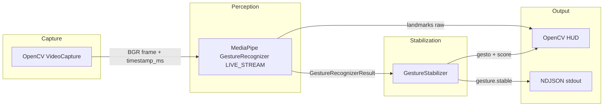
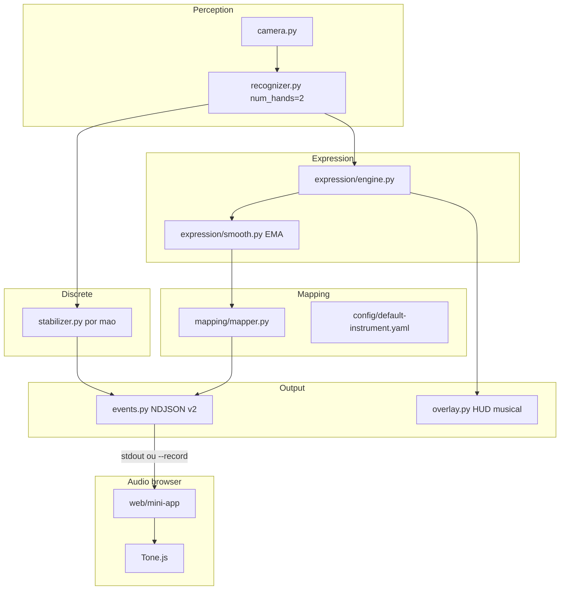

# Arquitetura — Hand Gestures

## Visão geral

O MVP separa quatro camadas desacopladas:



| Camada | Módulo | Responsabilidade |
|--------|--------|------------------|
| Capture | `camera.py` | Frames BGR, timestamps monotônicos |
| Perception | `recognizer.py` | Landmarks + gesto + handedness + score |
| Stabilization | `stabilizer.py` | Votação majoritária, cooldown, anti-flicker |
| Presentation | `overlay.py` | Desenho landmarks + HUD |
| Contract | `events.py` | Schema Pydantic → JSON |

## Contrato de eventos

### `gesture.stable` (MVP)

Emitido apenas quando o gesto estável **muda** (inclui transição para `None`).

```json
{
  "type": "gesture.stable",
  "gesture": "Thumb_Up",
  "score": 0.87,
  "handedness": "Right",
  "timestamp_ms": 1234567890,
  "landmarks": null
}
```

| Campo | Tipo | Descrição |
|-------|------|-----------|
| `type` | string | Sempre `gesture.stable` no MVP |
| `gesture` | string | Nome MediaPipe ou `None` |
| `score` | float | 0.0–1.0; 0 quando `None` |
| `handedness` | string \| null | `Left`, `Right` ou null |
| `timestamp_ms` | int | `time.monotonic() * 1000` no envio |
| `landmarks` | array \| null | 21 pontos `{x,y,z}` normalizados se `--with-landmarks` |

### Reservado (futuro)

- `gesture.candidate` — resultado bruto por frame (debug)
- `gesture.none` — explícito quando mão sai do quadro

### Consumo via pipe

```bash
hand-gestures 2>/dev/null | while read -r line; do
  echo "Evento: $line"
done
```

No Node/React (fase futura), parsear NDJSON linha a linha ou usar WebSocket se backend intermediário.

## Estabilização

1. Score abaixo de `score_threshold` → rótulo `None`
2. Buffer circular (`vote_window`) → moda
3. Mudança confirmada após `min_consecutive` frames com mesma moda
4. `cooldown_ms` entre emissões de eventos

Parâmetros ajustáveis via CLI (`--vote-window`, `--min-consecutive`, `--cooldown-ms`, `--score-threshold`).

## Fase 2 — Instrumento gestual (implementado)

Modo `--musical`: duas mãos, controle contínuo estilo theremin e eventos v2.



| Camada | Módulo | Responsabilidade |
|--------|--------|------------------|
| Perception | `recognizer.py` | `HandsSnapshot` (left/right), `num_hands=2` |
| Discrete | `stabilizer.py` | `gesture.stable` por mão |
| Expression | `expression/` | landmarks → features + suavização |
| Mapping | `mapping/` | YAML → `control.frame` |
| Contract | `events.py` | `control.frame`, `control.change`, throttle |
| Presentation | `overlay.py` | Barras pitch/pan/volume, distância L/R |
| Audio | `web/mini-app/` | Replay NDJSON + Tone.js |

Contrato e fluxo Python → React: [musical-mapping.md](musical-mapping.md).

```bash
hand-gestures --musical --pick-camera
hand-gestures --musical --record events.ndjson
cd web/mini-app && npm run dev
```

## Fase 3 — Web embed / produção

- MediaPipe no browser (`@mediapipe/tasks-vision`) ou WebSocket se pipe for insuficiente
- Quantização musical, presets adicionais, calibração `--calibrate`

## Fase 4 — Embeddable na web

### Opção A — Inferência no browser (recomendada)

- Pacote `@mediapipe/tasks-vision` no React
- `getUserMedia` para câmera
- Mesmos gestos canned; compartilhar JSON Schema com Python
- Zero latência de rede; funciona offline

### Opção B — Backend Python + WebSocket

- FastAPI envia `GestureEvent` por WebSocket
- Cliente React só renderiza e toca áudio
- Trade-off: latência, deploy, banda se enviar frames

### Opção C — Modelo custom ONNX

- Coletar landmarks (63 dims) + treinar MLP leve
- Export ONNX → `onnxruntime-web`
- Quando gestos canned forem insuficientes

## Extensão: gestos custom

1. Gravar landmarks com app de coleta (script futuro)
2. Treinar classificador (PyTorch MLP)
3. Export ONNX ou integrar classificador custom no MediaPipe Tasks
4. Manter mesmo contrato `gesture.stable` com novos rótulos

## Threading e performance

- MediaPipe `LIVE_STREAM` usa callback assíncrono; snapshot protegido por `threading.Lock`
- Loop principal: captura → `recognize_async` → lê snapshot → stabilizer → overlay
- Frames ignorados se recognizer ocupado (comportamento nativo MediaPipe)
- Meta: ≥15 FPS em laptop; HUD exibe média móvel de 30 amostras
