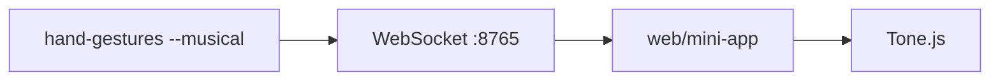

# Mapeamento musical — Fase 2

Este documento descreve o contrato NDJSON v2, o YAML de instrumento e como conectar o Python ao mini-app React/Tone.js.

## Fluxo



## Executar ao vivo (recomendado)

```bash
# Terminal 1
pip install -e .
hand-gestures --musical --pick-camera

# Terminal 2
cd web/mini-app && npm install && npm run dev
# http://localhost:5173 → Iniciar experiência
```

O modo `--musical` inicia o servidor WebSocket na porta **8765** e retransmite cada evento NDJSON. A mini-app conecta automaticamente — não é necessário carregar `events.ndjson`.

Opções relevantes:

| Flag | Descrição |
|------|-----------|
| `--musical` | 2 mãos, `control.frame` ~30 Hz, WebSocket :8765 |
| `--port 8765` | Porta WebSocket |
| `--window-width` / `--window-height` | Tamanho inicial da janela OpenCV (redimensionável) |
| `--emit-rate 30` | Taxa máxima de `control.frame` (Hz) |
| `--record arquivo.ndjson` | Gravação opcional (debug) |

A janela Python usa `WINDOW_NORMAL` — arraste as bordas para redimensionar.

## Eventos v2

### `gesture.stable`

Emitido quando o gesto estável **muda** por mão (cooldown ~300 ms).

```json
{
  "schema_version": "2",
  "type": "gesture.stable",
  "hand": "Right",
  "gesture": "Thumb_Up",
  "score": 0.87,
  "handedness": "Right",
  "timestamp_ms": 1234567890
}
```

### `control.frame` (~30 Hz)

Parâmetros já mapeados pelo YAML — o cliente não recalcula pitch/pan/volume.

```json
{
  "schema_version": "2",
  "type": "control.frame",
  "timestamp_ms": 1234567890,
  "preset": "scale_gate",
  "scale": "pentatonic",
  "left": {
    "presence": true,
    "x": 0.42,
    "y": 0.61,
    "z": 0.35,
    "pan": -0.2,
    "pitch_norm": 0.71,
    "mod": 0.4,
    "gesture": "None",
    "gate_open": false,
    "scale_degree": null
  },
  "right": {
    "presence": true,
    "x": 0.58,
    "y": 0.45,
    "z": 0.28,
    "pan": 0.3,
    "pitch_norm": 0.55,
    "mod": 0.5,
    "gesture": "Open_Palm",
    "gate_open": true,
    "scale_degree": 3
  },
  "pair": {
    "hands_distance": 0.62,
    "volume_master": 0.62,
    "spread": 0.45,
    "volume_active": false
  }
}
```

### `control.change`

Mudanças discretas (preset, efeito, etc.) disparadas por gesto mapeado.

```json
{
  "schema_version": "2",
  "type": "control.change",
  "timestamp_ms": 1234567890,
  "change": "note_on",
  "value": "Thumb_Up"
}
```

## Modo `scale_gate` (default)

Preset pensado para **teclado gestual**: notas da escala quantizadas com histerese, sustentação enquanto a palma direita está aberta e release no punho.

| Gesto | Mão | Ação musical |
|-------|-----|--------------|
| **Open_Palm** | Direita | Note ON + sustain (gate latched aberto) |
| **Closed_Fist** | Direita | Note OFF (gate fechado) |
| **Pointing_Up** | Direita | Acento na nota atual (requer gate aberto) |
| **Thumb_Up** / **Thumb_Down** | Esquerda | Sobe / desce oitava (+12 semitons) |
| **Victory** | Direita | **Segure** V: volume ativo (0–100% pela distância entre as mãos); solte V → desliga |
| Movimento Y (dir.) | Direita | Faixa da escala (`scale_degree`, N zonas conforme `scale.name`) |
| Distância L–R | Par | Com **V segurado** e 2 mãos: auto-calibração 0–100%; ao soltar V mantém o último volume |

Dicas de performance:

- **Palma aberta = segura a tecla** — a nota mantém enquanto o gesto estável for `Open_Palm`.
- **Punho = solta** — `gate_open: false` e o synth faz `triggerRelease`.
- Mova a mão direita na vertical entre **faixas** claras (config `scale.zone_ratio`); transição com glide curto no browser.
- **Victory (V)** na mão direita: **segure** para controlar volume pela distância (0% junto → 100% afastado). O gate da palma pode permanecer aberto — alterne palma (nota) e V (volume com duas mãos).
- Pan e mod/reverb contínuos estão desativados (`pan=0`, `mod=0`).

O preset **`theremin`** permanece disponível no YAML: drone contínuo com `triggerAttack` e ramp de frequência (comportamento anterior).

Campos extras em `HandControl` (v2, retrocompatíveis):

| Campo | Tipo | Descrição |
|-------|------|-----------|
| `gesture` | string \| null | Gesto estabilizado atual (por frame) |
| `gate_open` | bool | Porta de nota derivada de `gesture_roles` |
| `scale_degree` | int \| null | Índice quantizado na escala (mão de pitch) |

## YAML (`config/default-instrument.yaml`)

| Seção | Função |
|-------|--------|
| `preset` | `scale_gate` ou `theremin` — enviado em cada `control.frame` |
| `scale` | `name` (`pentatonic`, `chromatic`, `chromatic_2`, `blues`, `dorian`, …), `zone_ratio` |
| `gesture_roles` | `gate_on`, `gate_off`, oitava por gesto |
| `roles` | `pitch_axis: y` (altura da nota) |
| `pair` | `volume_dist_min` / `volume_dist_max` (opcional), `volume_master`, `volume_active` |
| `gesture_triggers` | Polegar → oitava (sem Victory — volume é hold por frame) |

Escalas disponíveis em `scale.name`:

| Nome | Notas (ex. C4) |
|------|----------------|
| `pentatonic` | 8 |
| `major` / `minor` | 8 |
| `chromatic` | 12 (1 oitava) |
| `chromatic_2` | 24 (2 oitavas) |
| `blues` | 7 |
| `dorian` | 8 |

Para cromática densa, use `zone_ratio: 0.40`–`0.45`.

### Volume (Victory + distância)

1. Segure **Victory** na mão direita com **as duas mãos** visíveis.
2. Afastar e aproximar os punhos define o mínimo e o máximo da sessão (auto-calibração em `src/expression/distance.py`).
3. Ao **soltar** V, o volume **permanece** no último valor (não volta a 75%).
4. `pair.volume_dist_min` / `volume_dist_max` no YAML são **opcionais** e só entram em cena antes da primeira calibração; depois prevalece o range auto.
5. No overlay OpenCV, as linhas de faixa da escala ficam na **faixa lateral do vídeo**, não sobre o painel de texto.

Exemplo de trigger:

```yaml
gesture_triggers:
  Thumb_Up:
    action: note_on
    note: C4
    hand: right
```

Volume hold (não é trigger YAML): `volume_active` segue o gesto **live** `Victory` na mão direita; calibração em `src/expression/distance.py`.

## Mini-app React + Tone.js

```bash
cd web/mini-app
npm install
npm run dev
```

1. Abra a URL do Vite (ex.: `http://localhost:5173`).
2. Clique em **Iniciar áudio** (política de autoplay).
3. **Carregar events.ndjson** — arquivo gerado com `--record`.

Comportamento (`preset: scale_gate`):

- `control.frame` → `gate_open`, `scale_degree`, `pair.volume_master` (0–1), `pair.volume_active`.
- `gesture.stable` → acento, oitava; volume via **segurar** Victory (`pair.volume_active` no frame).
- **Gate latched** (Python): abre após palma estável; mantém aberto em gestos intermediários; fecha só com punho confirmado.

Comportamento (`preset: theremin`):

- `control.frame` → drone contínuo: frequência desliza com `pitch_norm`, volume e reverb como antes.

### Pipe Python → Node (opcional)

No Windows o pipe direto pode ser frágil; prefira `--record` para desenvolvimento.

```bash
# Exemplo conceitual (Linux/macOS/Git Bash)
hand-gestures --musical 2>log.txt | node scripts/ndjson-consumer.js
```

### WebSocket

Implementado em `src/ws_hub.py` — ativado automaticamente com `--musical` (porta 8765).

## Features contínuas (antes do YAML)

| Feature | Origem | Uso default |
|---------|--------|-------------|
| `y_norm` | punho / palma | pitch |
| `hands_distance` | distância 2D L/R | volume (com Victory + 2 mãos) |
| `spread` | bbox das duas mãos | timbre (opcional) |

Suavização: EMA + zona morta em `src/expression/smooth.py`. Gestos discretos: `stabilizer.py` (~300 ms cooldown).

## Uma mão visível

O slot ausente envia `presence: false`. O mapeamento usa a mão presente; `hands_distance` decai suavemente quando só uma mão é detectada.

## Calibração (futuro)

`--calibrate` para gravar min/max por eixo em `config/calibration.json` — não implementado no MVP; ranges fixos 0–1 com clamp.

## Troubleshooting (som e HUD)

### Não ouço som

1. **Python não toca áudio** — só a mini-app React (`npm run dev`).
2. **Rode o Python antes** — `hand-gestures --musical --pick-camera` deve mostrar `WebSocket: ws://localhost:8765`.
3. **Iniciar experiência** no browser — beep A4 confirma áudio; status deve mostrar **● Ao vivo**.
4. **Firewall** — permita conexão local na porta 8765.

### “2 mãos” no Python mas não no browser

- Badges **Esq** e **Dir** no HUD refletem `left.presence` e `right.presence` do frame ao vivo.
- O synth prioriza a mão direita; ambas aparecem no visualizador (orbes laranja/ciano).

### HUD OpenCV (modo musical)

Painel **inferior esquerdo** na janela da webcam:

- **Esq / Dir** — altura Y e faixa da escala (mão direita).
- **Volume** — percentual; `Victory ON/OFF` no painel.
- Legenda: `Y=nota  Victory=vol por distancia`.

### Mini-app: HUD (scale_gate)

| Elemento | Significado |
|----------|-------------|
| **GATE ON/off** | Palma direita aberta = nota sustentada |
| Nota + grau | Ex.: `D4` · grau 3/8 |
| Gesto dir. | Gesto estabilizado da mão direita |
| Vol | Distância entre mãos (mín. 35% no browser) |

Visualizador: orbe ciano da mão direita **pulsa forte** com `gate_open`; escurece com punho fechado.

### Vibrato ou cortes com palma aberta

| Sintoma | Mitigação |
|---------|-----------|
| Tom “tremendo” | Engine não altera frequência se a nota não mudou; grau com debounce (3 frames) e `hysteresis: 0.08` no YAML |
| Som para ao mexer a mão esquerda | Gate **latched** (abre com gesto live, fecha com punho estável); `None` não fecha; ausência breve da mão não reseta; grace de 5 frames no browser |
| Ainda instável | Aumente estabilização: `--vote-window 14 --min-consecutive 7 --score-threshold 0.65` |

Modo `--musical` usa defaults mais estáveis (`vote_window=12`, `min_consecutive=6`) se você não passar essas flags.

### Ajuste fino (CLI)

| Flag | Efeito |
|------|--------|
| `--vote-window` | Janela de votação por gesto (maior = mais estável, mais lento) |
| `--min-consecutive` | Frames iguais antes de emitir `gesture.stable` |
| `--score-threshold` | Abaixo disso → gesto `None` (menos ruído) |
| `--cooldown-ms` | Intervalo mínimo entre eventos de gesto |

### Roadmap — reconhecimento

**Curto prazo:** gate latch + debounce de grau (implementado); `presence` com hold ao cruzar mãos; overlay “gate latched”.

**Médio prazo:** margem top1−top2 no score MediaPipe; suavização extra só em Y da mão direita; testes unitários `GateLatch` / `ScaleQuantizer`; resolução 1280 se CPU permitir.

**Longo prazo:** modelo customizado ou MLP em landmarks; delegate GPU; calibração `--calibrate` por usuário.
